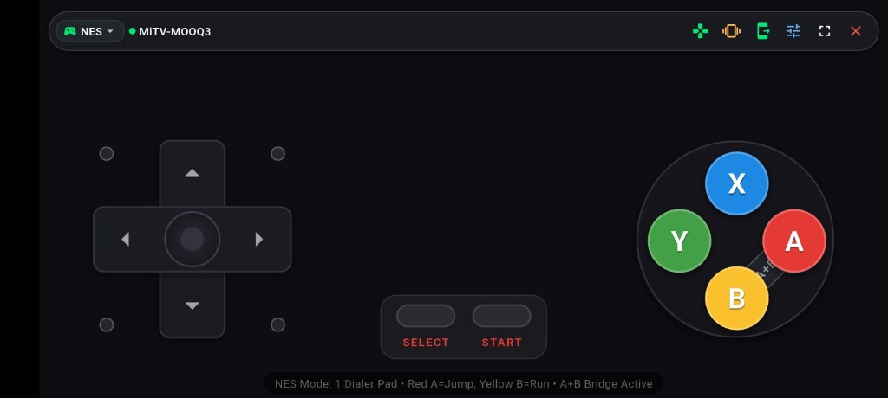
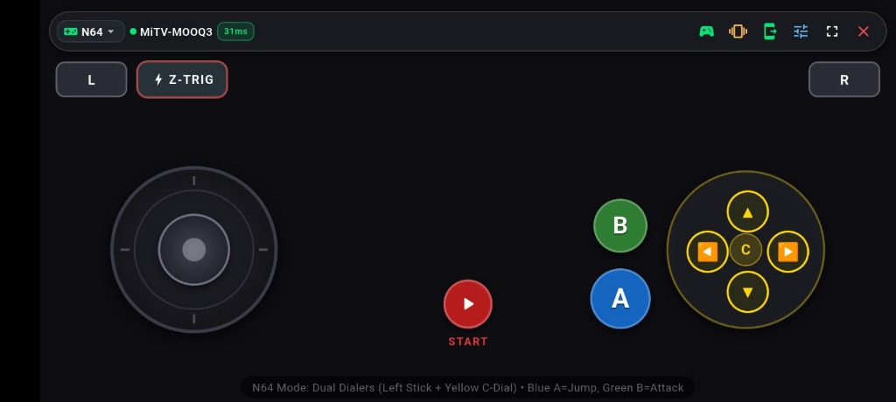
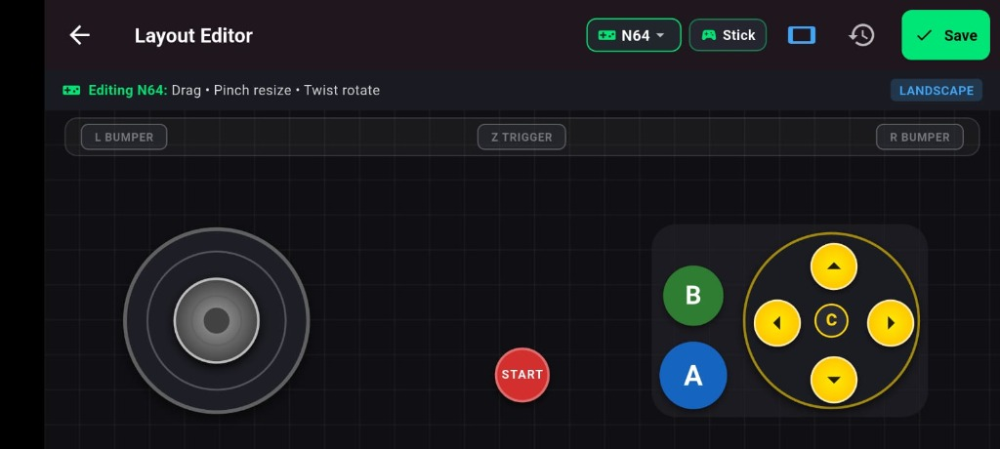
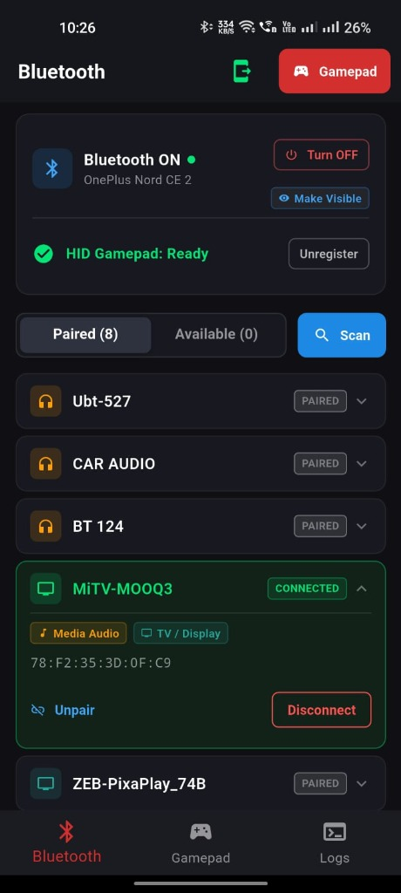

# PlayPad - Virtual Gamepad Controller

<p align="center">
  
</p>

<p align="center">
  <strong>Transform your Android phone into an ultra-low latency, multi-console Bluetooth HID Gamepad for Android TV, PC, Mac, Linux, and Retro Consoles.</strong>
</p>

<p align="center">
  
  
  
  
</p>

---

## 📖 Overview

**PlayPad** is a high-performance virtual gamepad application engineered to act as a **native hardware Bluetooth HID peripheral**. Unlike network-based remote apps that suffer from Wi-Fi jitter, socket timeouts, or require companion desktop server software, PlayPad registers directly into the Android OS Bluetooth stack as a standard **Human Interface Device (HID)**. 

Target devices—such as Android TVs (MiTV, Sony Bravia, Fire TV, Nvidia Shield), PCs, Raspberry Pi emulators (RetroPie, Batocera), and consoles—recognize your phone as a genuine, plug-and-play wireless game controller without requiring any companion app installed on the host.

---

## 📸 Screenshots & Feature Showcase

| **NES Retro Controller (Landscape Fullscreen)** | **N64 Dual-Dial Controller (Landscape Fullscreen)** |
|:---:|:---:|
|  |  |
| *Rolling 8-way directional pad with diagonal dots, A/B action bridge, Select/Start, and live connection HUD.* | *360° analog joystick, yellow C-Buttons dialer, blue A (Jump), green B (Attack), red Start, and shoulder bumpers.* |

| **Interactive Layout Editor (Drag & Scale)** | **Bluetooth HID Connection Manager** |
|:---:|:---:|
|  |  |
| *Customise button placements, dial sizes, rotations, and individual haptic profiles with live snap guides.* | *Clean ON/OFF state control, discoverable toggle, automated peripheral scan, device class detection, and signal strength.* |

---

## ✨ Key Features

### 1. Direct Fullscreen Landscape Gamepad
- **Zero Distraction Experience**: Tapping gamepad controls instantly opens a dedicated fullscreen landscape interface using `SystemUiMode.immersiveSticky`.
- **Live Latency & ACK Monitor**: Real-time transmission round-trip indicator displaying millisecond acknowledgment (`ACK: 31ms`) directly from the host.
- **Top Context Actions**: Quick access to controller switching (NES / N64), the visual layout editor, ROM server hub, and clean exit back to portrait mode.

### 2. Multi-Console Controller Emulation
- **NES / Classic Gamepad**:
  - Precision 8-way rolling D-pad with tactile diagonal combo dots.
  - Classic Nintendo diamond layout (`A`, `B`, `X`, `Y`) with an integrated **A+B combo bridge** for dual-finger thumb rolls.
  - Select and Start buttons with haptic feedback.
- **N64 Dual-Dial Gamepad**:
  - Precision 360° primary analog stick with deadzone calibration.
  - Dedicated **Yellow C-Buttons Dial** providing both 4-way discrete digital triggers and continuous rotational C-Stick vectors (`Z` and `Rz` axes).
  - Prominent N64 color scheme: Blue `A` (Jump), Green `B` (Action/Punch), and Red `Start`.
  - Top shoulder bumpers: `L`, `R`, and the underneath `Z-Trigger`.

### 3. Gesture-Based Layout Customizer
- **Interactive Multi-Touch Canvas**: Reposition buttons, scale elements up/down, and adjust spacing to comfortably match any hand size.
- **Persistent Profiles**: Custom element coordinates and scaling factors are saved locally per console type.
- **Haptic Feedback Engine**: Multi-tier vibration feedback (click, light, medium, heavy) on every touch press.

### 4. Robust Bluetooth Management & Reset Flow
- **Clean State Management**: Dedicated `[Turn ON]` and `[Turn OFF]` action controls prevent accidental toggle glitches and state desynchronization.
- **Subtle Visibility Toggle**: `[Make Visible]` discoverability pill lets host TVs easily discover the gamepad during initial pairing.
- **Automatic Device Classification**: Smart heuristics identify connected devices by class and UUID (e.g., distinguishing Android TVs, audio systems, mice, keyboards, and mobile devices).
- **Auto Reconnect & Paired Caching**: Remembers previously connected devices (`MiTV-MOOQ3`, etc.) for instantaneous one-tap reconnection.

### 5. Integrated ROM Wi-Fi Server & Android TV Push
- **Embedded HTTP Server (Port 8080)**: Run a local Wi-Fi server directly from the phone. Open the displayed IP address in any desktop browser to drag and drop ROM files wirelessly into the app storage.
- **Direct TV Push via Bluetooth OPP / OBEX**: Send game ROMs directly over Bluetooth Object Push Profile to Android TV storage without flash drives or cables.

---

## 📡 BLE & Bluetooth Core Implementation

PlayPad leverages advanced Android Bluetooth APIs and low-level HID driver specifications to achieve sub-millisecond input latency and rock-solid host stability.

```
┌────────────────────────────────────────────────────────────┐
│                    Flutter Presentation Layer              │
│       (GamepadScreen / VirtualJoystick / LayoutEditor)     │
└─────────────────────────────┬──────────────────────────────┘
                              │  MethodChannel: 'sendReport'
                              │  EventChannel:  'com.example.ble/events'
┌─────────────────────────────▼──────────────────────────────┐
│                    Android Native Layer (Kotlin)           │
│                      MainActivity.kt                       │
├────────────────────────────────────────────────────────────┤
│  BluetoothHidDevice Profile Proxy  │  BleGamepadService    │
│  - SDP Record (SUBCLASS2_GAMEPAD)  │  (Foreground Service) │
│  - HID Event Callback Handler      │  - WAKELOCK / CPU     │
└─────────────────────────────┬──────────────────────────────┘
                              │
                    L2CAP Channels (PSM 0x0011 / 0x0013)
                              │
┌─────────────────────────────▼──────────────────────────────┐
│                       Host Device                          │
│               (Android TV / PC / Linux / RetroPie)         │
└─────────────────────────────┘
```

### 1. Bluetooth Profile Architecture: HID Device (L2CAP) vs BLE (HOGP)
In standard Bluetooth, devices like TVs and PCs act as the **HID Host**, while peripherals (mice, keyboards, controllers) act as the **HID Device**.
- Traditional BLE peripheral setups often use **HOGP (HID Over GATT Profile)** over UUID `0x1812`. However, many Android TVs and older Bluetooth stacks either reject HOGP peripheral advertising from phones or enforce high connection intervals (>30ms).
- PlayPad implements the **Android `BluetoothHidDevice` API** operating over **Bluetooth Classic L2CAP channels**:
  - **PSM `0x0011`**: HID Control Channel (handles protocol queries, handshake, and power state).
  - **PSM `0x0013`**: HID Interrupt Channel (handles continuous, low-latency input report streams).
- Service Discovery Protocol (SDP) settings are registered with `BluetoothHidDevice.SUBCLASS2_GAMEPAD`, ensuring host systems recognize PlayPad as a dedicated hardware gaming controller.

### 2. Custom USB HID Report Descriptor Engineering
A key technical accomplishment in PlayPad is custom report descriptor engineering to prevent byte misalignment and jitter.

#### The 4-Bit Hat Switch Alignment Fix
Standard USB HID Hat Switches occupy 4 bits (values `1` to `8` for directions, `0` for neutral). When unaligned, subsequent 16-bit button reports become bit-shifted, causing button presses to register as phantom joystick movements.
PlayPad resolves this by specifying an explicit **4-bit constant padding** configured as `Const, Var, Abs` (`0x81, 0x03`):

```c
// Hat Switch (D-Pad, 4 bits)
0x05, 0x01,       // USAGE_PAGE (Generic Desktop)
0x09, 0x39,       // USAGE (Hat switch)
0x15, 0x01,       // LOGICAL_MINIMUM (1)
0x25, 0x08,       // LOGICAL_MAXIMUM (8)
0x35, 0x00,       // PHYSICAL_MINIMUM (0)
0x46, 0x3B, 0x01, // PHYSICAL_MAXIMUM (315)
0x65, 0x14,       // UNIT (Eng Rot: Angular Pos)
0x75, 0x04,       // REPORT_SIZE (4 bits)
0x95, 0x01,       // REPORT_COUNT (1)
0x81, 0x42,       // INPUT (Data, Var, Abs, Null)

// 4-bit Alignment Padding (Crucial for host byte boundary)
0x75, 0x04,       // REPORT_SIZE (4 bits)
0x95, 0x01,       // REPORT_COUNT (1)
0x81, 0x03,       // INPUT (Const, Var, Abs) -> 0x03 = Constant, Variable, Absolute

// 16 Discrete Buttons (2 full bytes)
0x05, 0x09,       // USAGE_PAGE (Button)
0x19, 0x01,       // USAGE_MINIMUM (Button 1)
0x29, 0x10,       // USAGE_MAXIMUM (Button 16)
0x15, 0x00,       // LOGICAL_MINIMUM (0)
0x25, 0x01,       // LOGICAL_MAXIMUM (1)
0x75, 0x01,       // REPORT_SIZE (1 bit)
0x95, 0x10,       // REPORT_COUNT (16)
0x81, 0x02,       // INPUT (Data, Var, Abs)
```

#### Multi-Axis Analog Stick Mapping
For analog sticks, values are normalized from floating point `[-1.0, 1.0]` to unsigned 8-bit integers `[0..255]`:
- `0` represents full negative (Left / Up)
- `128` represents exact dead-center neutral
- `255` represents full positive (Right / Down)

### 3. Touchscreen Minimum Pulse-Hold Duration
Touchscreens register taps for as little as 10–20 milliseconds. Because retro console emulators sample controller input at 60 Hz (every 16.6 ms), ultra-fast taps can fall between poll frames and be dropped.
PlayPad incorporates an active **Pulse-Hold Guarantee (`minHoldDuration = 55ms`)**. When a user quickly taps a button, the input report is held active across at least three host polling cycles before automatically resetting to neutral.

```dart
// Minimum hold guarantee snippet from NesGamepadController
static const Duration minHoldDuration = Duration(milliseconds: 55);

if (isPressed) {
  _pressTimes[button] = DateTime.now();
  _setButtonState(button, true);
} else {
  final pressTime = _pressTimes[button];
  final elapsed = pressTime != null ? DateTime.now().difference(pressTime) : minHoldDuration;
  if (elapsed < minHoldDuration) {
    _pendingReleaseTimers[button] = Timer(minHoldDuration - elapsed, () {
      _setButtonState(button, false);
    });
  } else {
    _setButtonState(button, false);
  }
}
```

### 4. Android OS Security Constraints (API 33+)
Beginning with Android 13 (API 33), invoking `BluetoothAdapter.disable()` programmatically is blocked by the OS for security reasons, returning `false` or requiring system settings.
- PlayPad handles this gracefully: instead of triggering unwanted full-page OS redirects, the app manages state directly within the current screen.
- When turning Bluetooth ON, PlayPad invokes `BluetoothAdapter.ACTION_REQUEST_ENABLE` as an in-screen overlay prompt.
- Whenever Bluetooth state transitions occur externally or via quick settings, the native `BroadcastReceiver` notifies Flutter through the `EventChannel`, triggering `resetRegistration()` to cleanly flush proxies and re-synchronize the UI.

### 5. Object Push Profile (OPP) & OBEX TV Transfer
For transferring game ROMs without needing cables or flash drives:
- PlayPad configures an Android `Intent.ACTION_SEND` targeting `com.android.bluetooth`.
- Attaches the ROM's `content://` URI via Android `FileProvider`.
- Targets the bonded TV device using `android.bluetooth.device.extra.DEVICE`, triggering an immediate, direct OBEX file transfer to the TV.

---

## 🏗 Project Architecture

```
lib/
├── main.dart                          # Application entry point & theme initialization
├── gamepad/
│   ├── controller_factory.dart        # Dynamic layout resolver (NES vs N64)
│   ├── gamepad_controller.dart        # Abstract base controller interface
│   ├── nes_gamepad_controller.dart    # NES logic, rolling D-pad & 4-bit padded descriptor
│   └── n64_gamepad_controller.dart    # N64 dual-dial stick, C-Buttons, & Z/Rz axes
├── hid/
│   ├── ble_logger.dart                # Diagnostics logger with logcat streaming
│   ├── bluetooth_connection_manager.dart # Connection state & bonding manager
│   ├── hid_register.dart              # Profile proxy listener & ACK telemetry
│   └── permission_service.dart        # Android 12+ runtime permission handler
├── models/
│   ├── controller_layout.dart         # Serializable layout geometry (x, y, scale)
│   ├── haptic_settings.dart           # Haptic vibration configuration
│   └── log_entry.dart                 # Real-time event log data model
├── screens/
│   ├── bluetooth_screen.dart          # Main Bluetooth Manager & device discovery
│   ├── gamepad_screen.dart            # Fullscreen landscape controller interface
│   ├── controller_edit_screen.dart    # Interactive drag & scale layout editor
│   ├── add_roms_dialog.dart           # TV Push & ROM management modal
│   └── permission_screen.dart         # Permission onboarding flow
├── server/
│   ├── rom_server.dart                # Embedded Wi-Fi HTTP upload server
│   └── tv_pusher_service.dart         # Bluetooth OPP / OBEX TV file pusher
└── widgets/
    └── virtual_joystick.dart          # Low-latency multi-touch analog dialer
```

---

## 🚀 Getting Started

### Prerequisites
- **Flutter SDK**: `>= 3.3.0`
- **Android Device**: Android 9.0 (API 28) or higher with Bluetooth HID Device support.
- **Host Device**: Android TV, PC (Windows / macOS / Linux), or any gaming system with Bluetooth support.

### Building & Running

1. **Clone the repository**:
   ```bash
   git clone https://github.com/your-username/PlayPad.git
   cd PlayPad
   ```

2. **Install Flutter dependencies**:
   ```bash
   flutter pub get
   ```

3. **Connect your Android phone via USB** and run in debug or release mode:
   ```bash
   flutter run --release
   ```

4. **Build APK**:
   ```bash
   flutter build apk --release
   ```

---

## 🎮 How to Connect to your TV / Host

1. Launch **PlayPad** on your phone and grant the required Bluetooth and Location permissions.
2. Tap **Register Gamepad** in the app.
3. Tap **[Make Visible]** to enable Bluetooth discoverability for 5 minutes.
4. On your **Android TV** (or PC):
   - Go to **Settings -> Remotes & Accessories -> Add Accessory**.
   - Select **NES Gamepad** or **N64 Gamepad** from the list of available devices.
   - Accept the pairing prompt on both devices.
5. Once paired, tap the **Gamepad** button in PlayPad. The app immediately locks into **Fullscreen Landscape Mode** with real-time latency feedback!

---

## 📄 License

This project is licensed under the MIT License - see the [LICENSE](LICENSE) file for details.
